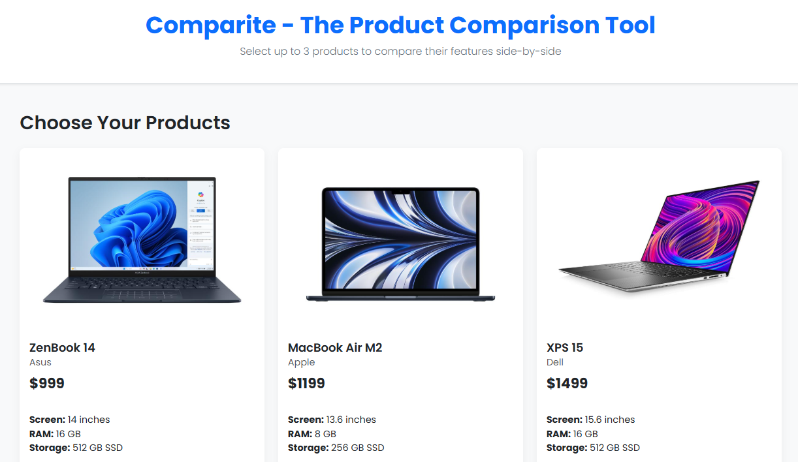

Comparite - Web Comparison Tool
Project Overview
Comparite is a web-based comparison tool built with modern frontend technologies. It allows users to easily compare products, services, or other items side-by-side with a clean, intuitive interface.

Live Demo
The project is deployed on Netlify and can be accessed here:
🔗 [Comparite Live Demo](https://incomparable-taiyaki-7dc417.netlify.app/)

Technologies Used
HTML5 - For structure and semantic markup

CSS3 - For styling and responsive design

JavaScript - For core functionality

jQuery - For DOM manipulation and event handling

Netlify - For hosting and continuous deployment

Features
Side-by-side comparison interface

Responsive design that works on all devices

Interactive elements with smooth animations

Easy-to-use controls for managing comparisons

Clean, modern UI with intuitive navigation

Installation
No installation required for use - simply visit the live demo link above.

For local development:

Clone this repository

Open index.html in your browser

Contributing
Contributions are welcome! Please fork the repository and submit a pull request with your changes.

License
This project is open-source and available under the MIT License.

Contact
For questions or feedback, please open an issue on GitHub.
